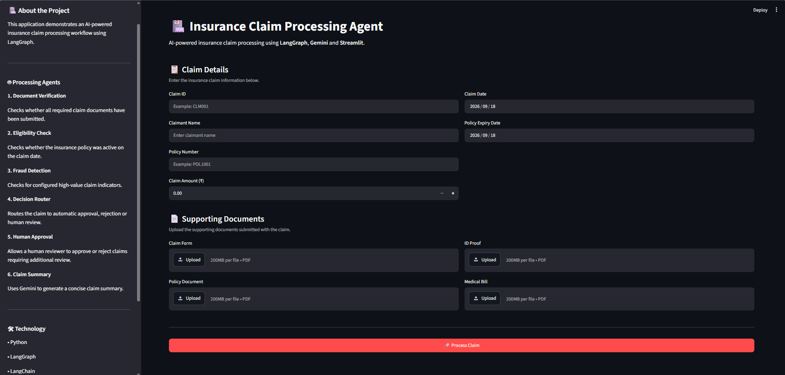

# Insurance Claim Processing Agent using LangGraph



An AI-powered insurance claim processing application built using LangGraph, LangChain, Google Gemini, and Streamlit.

## Project Overview

The Insurance Claim Processing Agent automates the processing of insurance claims through a multi-step LangGraph workflow.

The application performs document verification, eligibility checking, fraud-risk checking, decision routing, human approval when required, and AI-generated claim summarization.

The workflow uses parallel processing for document verification, eligibility checking, and fraud detection.

## Objective

The objective of this project is to build an automated insurance claim processing workflow that can:

- Verify whether required claim documents have been submitted.
- Check claim eligibility based on claim date and policy expiry date.
- Identify high-value claims requiring additional review.
- Automatically approve or reject eligible claims.
- Route uncertain or high-value claims to human review.
- Allow a human reviewer to approve or reject a claim.
- Generate an AI-powered claim summary.
- Provide an interactive Streamlit interface.

## Key Features

### Document Verification

The Document Verification Agent checks whether all required documents have been submitted.

Required documents:

- Claim Form
- Policy Document
- ID Proof
- Medical Bill

Possible results:

- `COMPLETE`
- `INCOMPLETE`

If required documents are missing, the claim is routed for rejection.

> Note: The current implementation verifies document submission/presence. It does not perform OCR, document authenticity verification, or detailed content validation.

### Eligibility Check

The Eligibility Check Agent compares the claim date with the policy expiry date.

If the claim date is on or before the policy expiry date, the claim is considered eligible.

Possible results:

- `ELIGIBLE`
- `INELIGIBLE`
- `UNKNOWN`

An expired policy results in claim rejection.

### Fraud Detection

The Fraud Detection Agent performs a rule-based high-value claim check.

The configured threshold is:

`₹500,000`

Claims above this threshold are marked:

`REVIEW_REQUIRED`

Claims below or equal to this threshold are marked:

`NO_MAJOR_INDICATOR`

> Note: This is a rule-based fraud-risk check for this educational project. It is not a trained machine learning fraud detection model.

### Decision Router

The Decision Router combines the outputs from:

- Document Verification
- Eligibility Check
- Fraud Detection

The claim is routed to one of three paths:

- `REJECT`
- `AUTO APPROVE`
- `HUMAN REVIEW`

### Human-in-the-Loop

Claims requiring additional review are paused using LangGraph's interrupt functionality.

The human reviewer can choose:

- Approve Claim
- Reject Claim

The final decision becomes:

`HUMAN APPROVED`

or

`HUMAN REJECTED`

### Claim Summary Agent

The Claim Summary Agent uses Google Gemini to generate a concise and professional summary of the processed claim.

The summary uses the available claim information, processing results, and final decision.

The prompt instructs the model not to invent information that is not provided.

## LangGraph Architecture

The workflow consists of multiple specialized processing nodes.

```text
                         START
                           |
             +-------------+-------------+
             |             |             |
             v             v             v
       Document        Eligibility     Fraud
       Verification       Check       Detection
             |             |             |
             +-------------+-------------+
                           |
                           v
                    Decision Router
                    /      |       \
                   /       |        \
                  v        v         v
              REJECT    APPROVE   HUMAN REVIEW
                                      |
                                      v
                               Human Approval
                                /          \
                               v            v
                           APPROVE        REJECT
                               |            |
                               v            v
                       HUMAN APPROVED  HUMAN REJECTED
                                \          /
                                 \        /
                                  v      v
                              Claim Summary
                                    |
                                    v
                                   END
```

## Parallel Processing

The following three nodes are executed as parallel branches:

Document Verification
Eligibility Check
Fraud Detection

Their results are combined before the Decision Router determines the next step.

## LangGraph Nodes
### 1. Document Verification

Function:

document_verification_agent

Purpose:

Checks whether the required claim documents have been submitted.

### 2. Eligibility Check

Function:

eligibility_check_agent

Purpose:

Checks the claim date against the policy expiry date.

### 3. Fraud Detection

Function:

fraud_detection_agent

Purpose:

Checks whether the claim amount exceeds the configured high-value threshold.

### 4. Decision Router

Function:

decision_router

Purpose:

Determines whether the claim should be rejected, automatically approved, or sent for human review.

### 5. Reject Claim

Function:

reject_claim

Purpose:

Sets the final decision to:

REJECT

### 6. Auto Approve Claim

Function:

approve_claim

Purpose:

Sets the final decision to:

AUTO APPROVE

### 7. Human Review

Function:

human_review_claim

Purpose:

Pauses the workflow and waits for a human decision.

### 8. Claim Summary

Function:

claim_summary_agent

Purpose:

Uses Google Gemini to generate the final claim summary.

## Conditional Routing

The Decision Router uses conditional routing based on the results of the three processing checks.

Missing Documents
       |
       v
    REJECT


Ineligible Claim
       |
       v
    REJECT


Eligibility Unknown
       |
       v
 HUMAN REVIEW


High-Value Claim
       |
       v
 HUMAN REVIEW


All Checks Passed
       |
       v
 AUTO APPROVE
 
## Human-in-the-Loop Flow

Claim Processing
       |
       v
High-Value / Review Required
       |
       v
Human Review
       |
       v
Workflow Pauses
       |
       v
Human Decision
      / \
     /   \
    v     v
APPROVE REJECT
   |       |
   v       v
HUMAN    HUMAN
APPROVED REJECTED
     \     /
      \   /
       v v
Claim Summary
       |
       v
      END

## Technologies Used
### Programming Language
* Python
### AI / LLM
* Google Gemini
### Agent and Workflow Framework
* LangGraph
* LangChain
* LangChain Core
### Web Application
* Streamlit
### PDF Support
* PyPDF
### Environment Management
* python-dotenv

## How to Use the Application
### Step 1: Enter Claim Information

Enter:

* Claim ID
* Claimant Name
* Policy Number
* Claim Amount
* Claim Date
* Policy Expiry Date
### Step 2: Upload Documents

Upload the available:

* Claim Form
* Policy Document
* ID Proof
* Medical Bill
### Step 3: Process the Claim

Click the process button to start the LangGraph workflow.

The application performs:

Document Verification
+
Eligibility Check
+
Fraud Detection
        |
        v
Decision Router
### Step 4: Review the Decision

The claim can result in:

* AUTO APPROVE
* REJECT
* HUMAN REVIEW
### Step 5: Human Review

If human review is required, the application pauses and provides:

* Approve Claim
* Reject Claim
### Step 6: Claim Summary

After the final decision, the application generates an AI-powered claim summary.

## Conclusion

The Insurance Claim Processing Agent demonstrates how LangGraph can be used to build a structured, multi-step agentic workflow for insurance claim processing.

The application combines deterministic business rules with an AI-powered claim summarization step and incorporates parallel processing, conditional routing, and Human-in-the-Loop approval.

The Streamlit interface allows users to process different insurance claim scenarios and view the resulting claim decision and summary.
